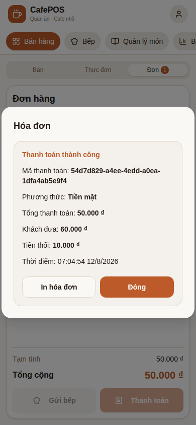

# Small POS · POS nhẹ cho quán nhỏ

[](https://github.com/longnick/small-pos-open-source/actions/workflows/ci.yml)
[](LICENSE)
[](https://github.com/longnick/small-pos-open-source/stargazers)
[](https://react.dev/)
[](https://www.typescriptlang.org/)
[](https://vite.dev/)

> **Offline-first, Vietnamese-first POS starter for small cafés and restaurants.**
> Build clear local order, payment, table, and receipt workflows before adding costly cloud infrastructure.

<p align="center">
  
</p>

**Live demo:** https://longnick.github.io/small-pos-open-source/ *(fixture data only; never use for real payments)*

Small POS is a public MIT-licensed reference implementation—not production payment software. It is for independent F&B teams, food stalls, and developers who want a small, inspectable foundation instead of an enterprise POS.

[Tiếng Việt](#tiếng-việt) · [Features](#features) · [Quick start](#quick-start) · [Contributing](#contributing)

## Features

- **Local order and table workflow** — select an empty table, create a local open order, add menu items, and adjust or remove order lines.
- **Safe integer-VND totals** — subtotal and discount calculations live in a small domain core.
- **Local payment flow** — cash calculates change; transfer, card, and other methods require an exact amount.
- **Receipt before release** — payment receipt shows payment ID, method, total, tender, change, and timestamp; users can print it with the browser print dialog.
- **Table lifecycle guard** — a matching occupied/waiting-payment table is released only after verified payment; invalid state/order combinations fail closed.
- **Responsive UI** — exercised at mobile, tablet, and desktop viewports.
- **Executable quality gates** — unit/component tests, Playwright browser tests, typecheck, build, and source-leakage scan.

## Demo evidence

The screenshot above is produced by the fixture-only mobile payment E2E flow:

```text
select occupied table → cash tender → local receipt → close receipt → table released
```

It uses fake data and a build-time E2E auth fixture. It never uses customer records, a real gateway, or production credentials.

## Tech stack

| Area | Technology |
| --- | --- |
| Frontend | React 19, TypeScript, Vite 8, Tailwind CSS |
| Local state | Zustand |
| UI primitives | Radix UI, Lucide |
| Planned local persistence | Dexie / IndexedDB — not wired into production flow yet |
| Tests | Vitest, Testing Library, Playwright |
| Automation | GitHub Actions |

## Quick start

**Requirements:** Node.js 22 and npm.

```bash
git clone https://github.com/longnick/small-pos-open-source.git
cd small-pos-open-source
npm ci
npm run dev
```

Open URL printed by Vite. Demo data only.

Run full local verification:

```bash
npm run ci
npm run test:e2e
npm run test:e2e:payment
npm run test:e2e:order
npm run test:e2e:visual
```

## Project boundaries

This repository deliberately does **not** include:

- production payment processing, VietQR/QR integration, or card handling;
- Firebase, cloud sync, live revenue/inventory reporting, or multi-device concurrency;
- electronic invoices, refunds, payroll, taxes, or production deployment guidance;
- real staff credentials or customer data.

The demo PIN verifier is ephemeral. Do not use it as production authentication. See [ROADMAP.md](ROADMAP.md) and [SECURITY.md](SECURITY.md) before extending this project.

## Architecture

```text
packages/pos-core/     Pure domain types and integer-VND calculations
src/stores/            Local Zustand state and trust-boundary guards
src/components/        React POS UI
src/auth/              Demo-only local authentication adapter
e2e/                   Fixture-authenticated Playwright tests
scripts/               Leakage scanner and verification helpers
```

## Contributing

Issues, docs improvements, accessibility work, test coverage, and small workflow fixes are welcome.

1. Read [CONTRIBUTING.md](CONTRIBUTING.md).
2. Search existing Issues and Discussions.
3. Choose a focused `good first issue` or `help wanted` task.
4. Keep changes test-backed; run `npm run ci` and relevant E2E tests.

Please do not include credentials, customer data, payment data, or real business configuration in issues or pull requests.

## Security, community, and license

- Security reports: [SECURITY.md](SECURITY.md)
- Community expectations: [CODE_OF_CONDUCT.md](CODE_OF_CONDUCT.md)
- License: [MIT](LICENSE)
- Ideas and usage questions: [GitHub Discussions](https://github.com/longnick/small-pos-open-source/discussions)

## Tiếng Việt

**Small POS** là mã nguồn mở cho quán ăn, quán cà phê, xe đồ ăn và mô hình F&B nhỏ. Mục tiêu: có luồng bán hàng cục bộ, dễ đọc và dễ kiểm thử trước khi thêm hạ tầng cloud tốn chi phí.

Hiện có: chọn bàn, đơn hàng, tính tiền VND an toàn, tiền thừa tiền mặt, thanh toán đúng số với chuyển khoản/thẻ, hóa đơn local có thể in, và trả bàn sau thanh toán hợp lệ.

Chưa có: VietQR, Firebase, cloud sync, tồn kho/doanh thu thời gian thực, cổng thanh toán, hoàn tiền, hóa đơn điện tử, hay hướng dẫn deploy production. Đây là các giới hạn có chủ đích để giữ core nhỏ và an toàn.

Nếu dự án hữu ích, hãy mở Issue/Discussion hoặc cho repo một Star để giúp nhiều người tìm thấy nó hơn.

## Maintainer use of Codex

Codex may help reproduce issues, extend tests, review local state transitions, document public APIs, and draft bounded PRs. Maintainer review and repository verification gates remain required before merge.
